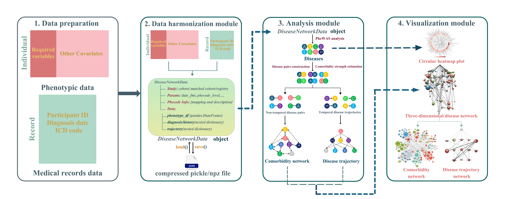
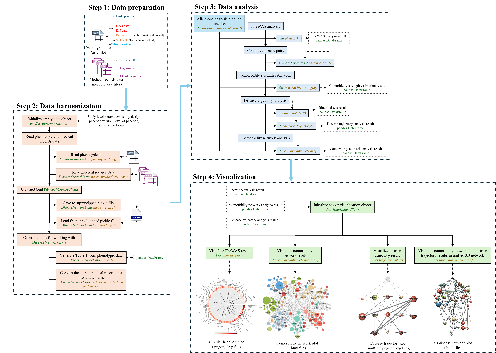

--------------------------------------------------------------------------------

DiNetxify is a Python package that provides two high-level features:
- DiNetxify provides comprehensive insights into multimorbidity patterns and disease progression pathways using EHR data
- DiNetxify emphasizes user-friendliness by integrating the entire analytical pipeline, from data harmonization and analysis to visualization

<!-- toc -->

- [More About DiNetxify](#more-about-DiNetxify)
  - [Workflow](#Workflow)
  - [Modular architecture](#Modular-architecture)
- [Installation and quick start](#installation-and-quick-start)
  - [Installation](#installation)
  - [Quick start](#quick-start)
- [Citation](#citation)
- [Contact](#contact)

<!-- tocstop -->

## More About DiNetxify

[Learn the basics of DiNetxify](./tutorial.md)
Usually, DiNetxify is used for:

- Research on comprehensive 3D disease network analyses using large-scale EHR data

Elaborating Further:

### Workflow
DiNetxify is an open-source Python package designed for end-to-end, comprehensive disease network analysis of large-scale EHR datasets. The below figure is analytical framework of DiNetxify.


### Modular architecture
At a granular level, DiNetxify is a library that consists of the following components:

| Component | Description |
| ---- | --- |
| [**DiNetxify.DiseaseNetworkData**] | A class for handling disease network data creation and operations |
| [**DiNetxify.visualization.Plot**] | A class integrates and visualizes disease relationships from three complementary analyses |

The core of the DiNetxify architecture is shown below:


## Installation and quick start

### Installation
Commands to install DiNetxify via pip
```bash
pip install DiNetxify
```

### Quick start
To begin using DiNetxify immediately, follow these essential steps:
1. Install the package via pip
2. Load our pre-trained model with just 2 lines of Python code
3. Run inference on your medical data using our streamlined API
For a comprehensive step-by-step tutorial with executable code samples, dummy data examples, and visual demonstrations, refer to our detailed Tutorial Guide . 

## Citation
If you use this software in your research, please cite:
```bibtex
@misc{DiNetxify,
  author = {Hou, Can and Liu, Haowen and Ahlqvist, Viktor H. and Gisladottir, Elisabet Unnur and Yang, Yao and Yang, Huazhen and Fang, Fang and Valdimarsdóttir, Unnur A. and Song, Huan},
  title = {{DiNetxify}},
  year = {2025},
  howpublished = {\url{https://github.com/HZcohort/DiNetxify}},
}
```

## Contact
- Can Hou: [houcan@wchscu.cn](mailto:houcan@wchscu.cn)
- Haowen Liu: [haowenliu81@gmail.com](mailto:haowenliu81@gmail.com)
